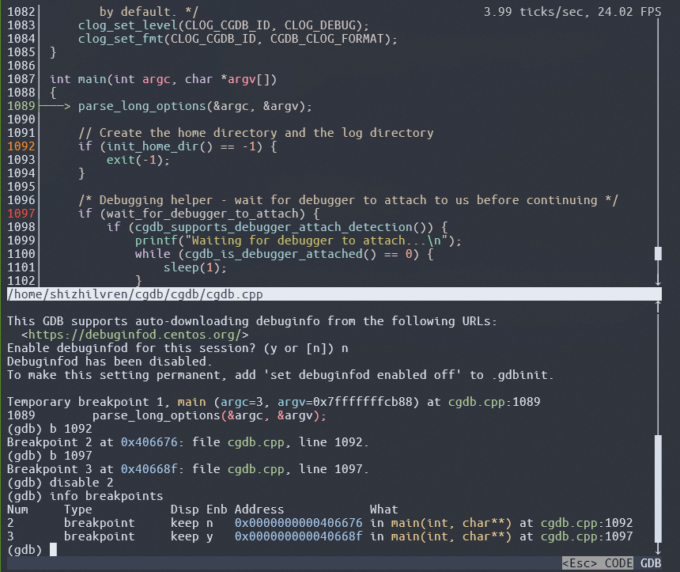

# RGDB

RGDB is a very lightweight console frontend to the GNU debugger(like [cgdb](https://github.com/cgdb/cgdb)). It provides a split screen interface showing the GDB session below and the program's source code above. 

## Screenshot

## Features

    - Syntax-highlighted source window
    - Visual breakpoint setting
    - Mouse scrollable for gdb history or source code 
  
## More

RGDB is designed for large-scale programs that are typically launched via wrapper scripts rather than directly executing the executable files. In such environments, debugger functionality is constrained due to the programs' massive symbol tables and the non-negligible latency inherent to every operation.
